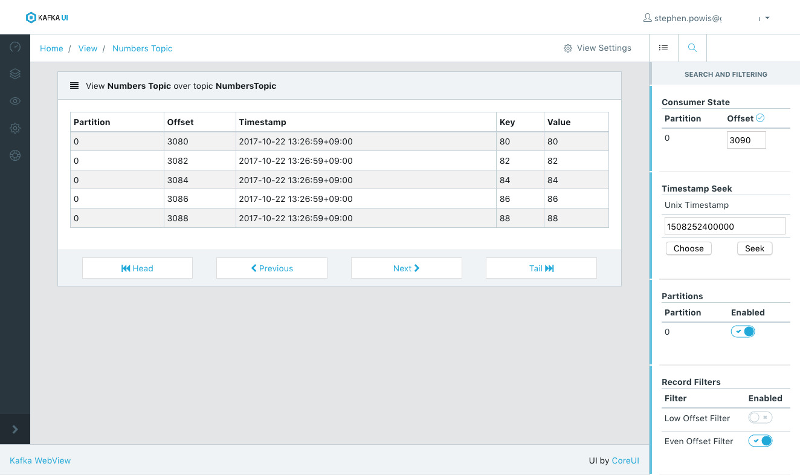
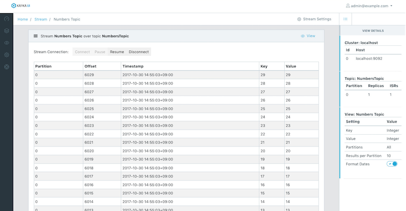
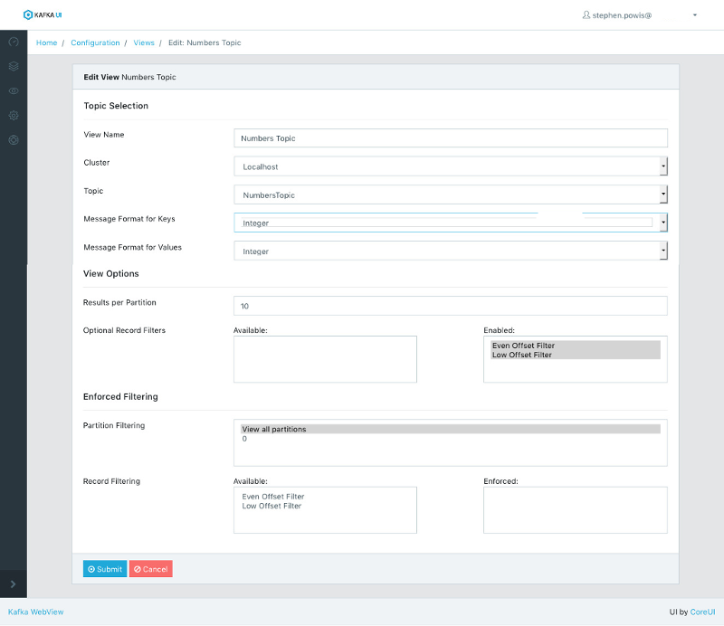

# Kafka WebView

This project aims to be a full-featured web-based [Apache Kafka](https://kafka.apache.org/) consumer.  **Kafka WebView** presents an easy-to-use web based interface for reading data out of kafka topics and providing basic filtering and searching capabilities.

### Features

- Connect to multiple remote Kafka Clusters
- Connect to SSL authenticated clusters
- Supports standard key and value deserializers
- Supports uploading custom key and value deserializers
- Supports both customizable and enforced filtering over topics
- Basic user management
- Web Based Consumer Supports
  - Seeking to offsets
  - Seeking to timestamps
  - Filtering by partition
  - Configurable server-side filtering logic
- "Live" web socket based streaming consumer
  
### Screen Shots

#### Web Consumer

#### Streaming Consumer

#### Configuration

## Installation ##

TODO

## Setup ##

### Setup users
                    
You first need to configure who has access to Kafka WebView.  Kafka WebView provides two roles for users: 
<strong>Admin</strong> and <strong>User</strong>.

<strong>Admin</strong> users have the ability to Manage and Configure all aspects of WebView, including defining Kafka Clusters,
add/remove users, define View etc.

<strong>User</strong> users have the ability to view Cluster information, and consume Views.

If you've logged in with the Default Admin account, you'll want to create your own Administrator user account
and remove the default one.

## Writing Custom Deserializers

The [Deserializer Interface](https://kafka.apache.org/0110/javadoc/org/apache/kafka/common/serialization/Deserializer.html)
is provided by Kafka, WebView requires nothing special or additional above implementing this interface.  If you already 
have a Deserializer implementation for consuming from Kafka then you simply can just use it as is.

If you don't already have an implementation, you can view the [interface here](https://github.com/apache/kafka/blob/0.11.0/clients/src/main/java/org/apache/kafka/common/serialization/Deserializer.java).

## Writing Custom Filters

The [RecordFilter Interface](https://github.com/Crim/kafka-webview/blob/master/kafka-webview-plugin/src/main/java/org/sourcelab/kafkaview/plugin/filter/RecordFilter.java)
is provided by Kafka WebView and is NOT part of the standard Kafka library.

## Example Deserializer and Filters Project

To get up and going quickly, the [Kafka-WebView-Example](#) project on GitHub can be cloned and used as a template.
This Maven based example project is configured with all of the correct dependencies and has a few example 
implementations.

### Packaging a Jar

If you're using the [Kafka-WebView-Example](#) project, it should be as simple as issuing the command `mvn package` and 
retrieving the compiled Jar from the target/ directory.
               
If you're building from your own project, you'll need to package a Jar that contains your implementation along with
any of it's required dependencies.

# Changelog

The format is based on [Keep a Changelog](http://keepachangelog.com/)
and this project adheres to [Semantic Versioning](http://semver.org/).

[View Changelog](CHANGELOG.md)
