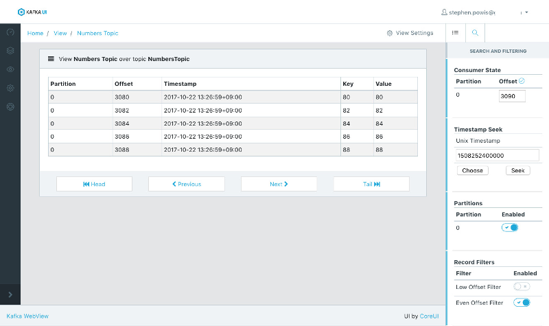
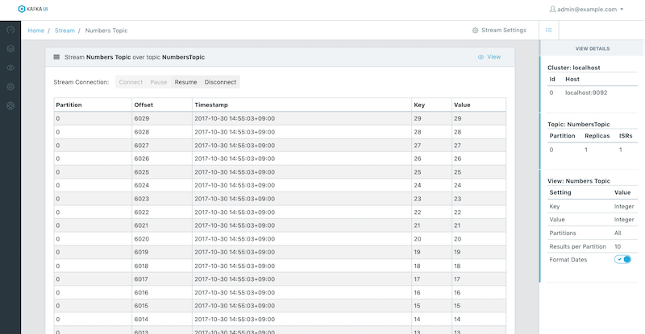
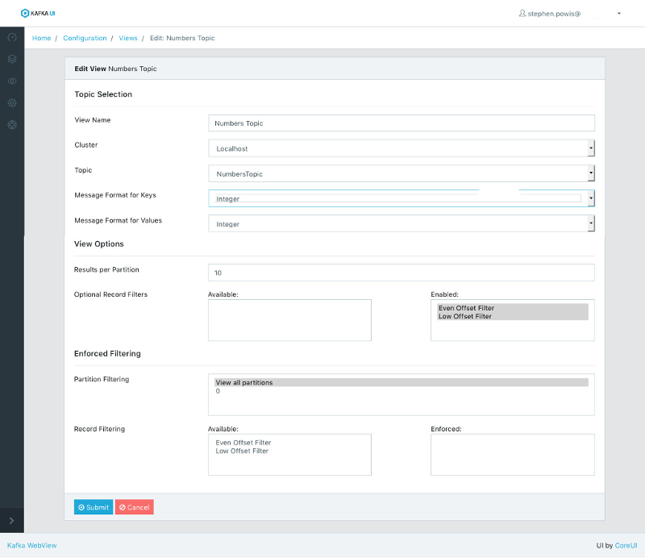

# Kafka WebView

This project aims to be a full-featured web-based [Apache Kafka](https://kafka.apache.org/) consumer.  **Kafka WebView** presents an easy-to-use web based interface for reading data out of kafka topics and providing basic filtering and searching capabilities.

### Features

- Connect to multiple remote Kafka Clusters.
- Connect to SSL and SASL authenticated clusters.
- Supports standard key and value deserializers.
- Supports uploading custom key and value deserializers.
- Supports both customizable and enforced filtering over topics.
- Supports multiple user management and access control options:
  - Use in app defined users (default).
  - Disable user authorization entirely (open anonymous access).
- Web Based Consumer Supports:
  - Seeking to offsets.
  - Seeking to timestamps.
  - Filtering by partition.
  - Configurable server-side filtering logic.
- "Live" web socket based streaming consumer.
- Consumer group state monitoring
  
### Screen Shots

#### Web Consumer


#### Streaming Consumer


#### Configuration


## Installation from release distribution 

Download the latest [release](https://github.com/SourceLabOrg/kafka-webview/releases) package and extract the ZIP file.

### Configuration

Edit the **config.yml** file at the root of the extracted package. 

The **server port** can be modified to set what port Kafka WebView UI will bind to.  

The **app key** should be modified to be unique to your installation.  This key will be used for symmetric encryption of 
JKS/TrustStore secrets if you configure any SSL enabled Kafka clusters.

By default config.yml will look similar to:

```yml
server:
  ## What port to run the service on.
  port: 8080
  servlet:
    session:
      ## User login session timeout after 1 hour (3600 seconds)
      timeout: 3600


## Various App Configs
app:
  ## Should be unique to your installation.
  ## This key will be used for symmetric encryption of JKS/TrustStore secrets if you configure any SSL enabled Kafka clusters.
  key: "SuperSecretKey"

  ## Defines a prefix prepended to the Id of all consumers.
  consumerIdPrefix: "KafkaWebViewConsumer"
  
  ## Enable multi-threaded consumer support
  ## The previous single-threaded implementation is still available by setting this property to false.
  ## The previous implementation along with this property will be removed in future release.
  multiThreadedConsumer: true
  
  ## Sets upper limit on the number of concurrent consumers (non-websocket) supported.
  maxConcurrentWebConsumers: 32

  ## Sets upper limit on the number of concurrent web socket consumers supported.
  maxConcurrentWebSocketConsumers: 64

  ## User authentication options
  user:
    ## Require user authentication
    ## Setting to false will disable login requirement.
    enabled: true
```

### Starting the service

The Kafka WebView UI can be started by running the **start.sh** script from root of the extracted package.
This should start a webserver running on the port you configured.  Point your browser at `http://your.host.name:8080` or the port that you configured and follow the [Logging in for the first time](#logging-in-for-the-first-time) instructions below.

## Running with Docker

The Docker image builds from source and runs on Java 21.

Build and run the image directly:

```bash
docker build -t kafka-webview:local .
docker run -it -p 8080:8080 -p 9090:9090 -v kafkawebview_data:/app/data kafka-webview:local
```

Or use docker compose to start the app together with a local single-node Kafka broker:

```bash
docker compose up --build
```

When registering the compose cluster inside the WebView UI, use broker host `kafka:19092`.
From your host machine (e.g. `kafka-console-producer`), the broker is reachable at `localhost:9092`.

Point your browser at `http://localhost:8080` and follow the [Logging in for the first time](#logging-in-for-the-first-time) instructions below.

## Building from source

To build and run from the latest source code requires JDK 21 and Maven 3.6+.  Clone this project and run the [buildAndRun.sh](https://github.com/SourceLabOrg/kafka-webview/blob/master/buildAndRun.sh) script to compile the project and start the service.

Point your browser at `http://localhost:8080` follow the [Logging in for the first time](#logging-in-for-the-first-time) instructions below.

## Configure user authentication method

Kafka WebView supports two different methods for authenticating and authorizing users for access control.

#### Locally defined users

Using the default configuration, Kafka WebView will require users to login and access the app.  These users are locally defined
by an administrator user and managed within the application.  

Your application yml file should be configured with the following options:

```yml
## App Configs
app:
  ## User authentication options
  user:
    ## Ensure user authentication is ENABLED
    enabled: true
```

#### Anonymous / Open access

Kafka WebView can also be configured for open and anonymous access.  

Your application yml file should be configured with the following options:

```yml
## App Configs
app:
  ## User authentication options
  user:
    ## Ensure user authentication is DISABLED
    enabled: false
```

#### Reverse proxy setup

Kafka WebView can be configured to run behind a reverse proxy. See [docs/httpdReverseProxySetup.md](docs/httpdReverseProxySetup.md) for detailed instructions.

## Logging in for the first time

**NOTE** If you've **disabled user authentication** in your configuration, no login will be required. Skip directly to **Step 2**.

On first start up a default Administrator user will be created for you.  Login using `admin@example.com` with password `admin`

**NOTE** After logging in you should create your own Administrator user and remove the default account.

## Setup ##

### 1. Setup users
                    
You first need to configure who has access to Kafka WebView.  Kafka WebView provides two roles for users: 
**Admin** and **User**.  

- **Admin** has the ability to Manage and Configure all aspects of WebView, including defining Kafka Clusters, adding/removing users, defining Views etc.  
- **User** has the ability to view Cluster information and consume previously defined Views.

**NOTE** If you've logged in with the Default Admin account, you'll want to create your own Administrator user account
and remove the default one.

### 2. Connect Kafka clusters

You'll need to let WebView know about what Kafka clusters you want to connect.

WebView supports connecting to Clusters using plaintext or SSL.  You'll need to follow the [standard Kafka consumer client directions](https://kafka.apache.org/documentation.html#security_ssl) to
create a Java Key Store (JKS) for your Trusted CA (TrustStore), and a JKS for your Consumer Key (KeyStore).

If authenticating to a cluster using SASL, you'll need to define your authentication method and JAAS configuration.

### 3. Configure custom Message Formats (Optional)

Kafka allows you to store data within the Cluster in any data-format and provides an Interface to define how clients should 
Deserialize your data.  Out of the box Kafka WebView supports the following Deserializers that can be used for both Keys and Values:

- ByteArray
- Bytes
- Double
- Float
- Integer
- Long
- Short
- String

Often times data is stored using a custom format such as [Avro](https://avro.apache.org/) or [ProtocolBuffers](https://developers.google.com/protocol-buffers/).
Admin users can upload a JAR containing custom Deserializer implementations to extend support to WebView to be able to properly deserialize your data format.

### 4. Configure Filters (Optional)

Filters are a construct unique to WebView.  Filters allow you to implement an Interface that can be used on the **server side** to filter messages coming from Kafka.  There are several benefits to doing
filtering on the server side in this way.  These can be used as a simple search-like filter and avoid passing large amounts of data
to the client web browser when you're looking for a small subset of messages.  Filters could also be used to enforce a restricted view of data from a Topic.

### 5. Define Views

Views are the last step putting all of the pieces together.  Views let you configure a Topic to consume from, configure which Message Formats the Topic uses, and optionally apply any Filters.

## Writing Custom Deserializers

The [Deserializer Interface](https://kafka.apache.org/0110/javadoc/org/apache/kafka/common/serialization/Deserializer.html)
is provided by Kafka, WebView requires nothing special or additional above implementing this interface.  If you already 
have a Deserializer implementation for consuming from Kafka then you simply can just use it as is.

If you don't already have an implementation, you can view the [interface here](https://github.com/apache/kafka/blob/0.11.0/clients/src/main/java/org/apache/kafka/common/serialization/Deserializer.java).

**Important Note:** Kafka WebView will attempt to automatically convert objects returned from the Deserializer interface into a JSON representation for easy display in the browser (by way of [Jackson](https://github.com/FasterXML/jackson)).  This process is imperfect -- If you want your objects to be rendered within the browser in a specific way, it is **highly recommended** that your Deserializer implementation returns a pre-formatted String instead of a complex object.

## Writing Custom Filters

The [RecordFilter Interface](https://github.com/SourceLabOrg/kafka-webview/blob/master/kafka-webview-plugin/src/main/java/org/sourcelab/kafka/webview/ui/plugin/filter/RecordFilter.java)
is provided by Kafka WebView and is NOT part of the standard Kafka library.

## Example Deserializer and Filters Project

To get up and going quickly, the [Kafka-WebView-Example](https://github.com/SourceLabOrg/kafka-webview-examples) project on GitHub can be cloned and used as a template.
This Maven based example project is configured with all of the correct dependencies and has a few example 
implementations.

# Releasing
Steps for performing a release:

1. Update release version: `mvn versions:set -DnewVersion=X.Y.Z`
2. Validate and then commit version: `mvn versions:commit`
3. Update CHANGELOG and README files.
4. Merge to master.
5. Build a Docker image from source: `docker build -t kafka-webview:X.Y.Z .`
6. Create release on Github project.


# Changelog

The format is based on [Keep a Changelog](http://keepachangelog.com/)
and this project adheres to [Semantic Versioning](http://semver.org/).

[View Changelog](CHANGELOG.md)
